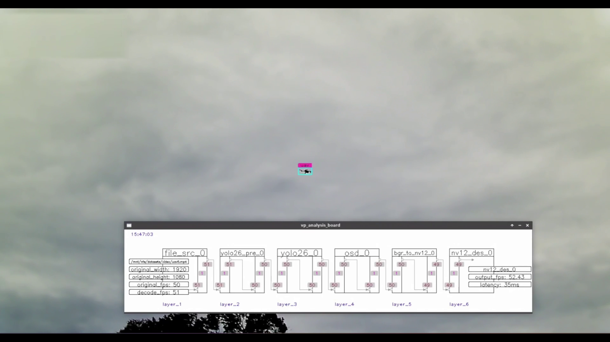

# DetectUav_RK3588 使用文档

本项目基于RK3588的芯片，使用YOLO26检测模型对低空无人机的实时检测，在OrangePi-5Plus和OrangePi-5Ultra进行了测试，FPS超过50.

## 程序运行展示



## 1. 主程序做了什么

当前主程序为 `main.cc`，启动后会构建并运行一条固定的视频检测链路：

`vp_mpp_sdl_src_node -> vp_yolo26_preprocess_node -> vp_rk_first_yolo26 -> vp_osd_node -> vp_bgr_to_nv12_node -> vp_nv12_sdl_des_node`

各节点职责如下：

- `vp_mpp_sdl_src_node`：读取本地视频，使用 FFmpeg demux + Rockchip MPP 硬解码，输出 NV12 帧（默认循环播放，并按源帧率节奏推流）
- `vp_yolo26_preprocess_node`：基于配置文件执行 YOLO26 预处理，生成模型输入数据
- `vp_rk_first_yolo26`：加载 RKNN 的 YOLO26 模型执行检测推理
- `vp_osd_node`：将检测框、类别和置信度绘制到画面
- `vp_bgr_to_nv12_node`：将 OSD 后的 BGR 图像转换为 NV12
- `vp_nv12_sdl_des_node`：通过 SDL2 进行 NV12 实时显示

主程序还包含以下运行行为：

- 默认输入视频：`/mnt/nfs/datasets/video/uav.mp4`
- 默认模型配置：`assets/configs/yolo26.json`
- 支持 `Ctrl+C`、终端 `ESC`、SDL 窗口退出三种方式优雅结束
- 启动 `vp_analysis_board` 显示非阻塞的数据流分析看板

## 2. 运行前准备

### 2.1 硬件与系统建议

- 硬件：RK3588（或同类支持 RKNN/MPP/RGA 的板卡），在OrangePi-5Plus和OrangePi-5Ultra进行了测试通过。
- 系统：Ubuntu 22.04 / Debian aarch64
- 架构：`aarch64`

### 2.2 安装系统依赖

你的系统镜像中，以下包已预装并 `hold` 锁定（如 `ffmpeg`、`libavcodec-dev`、`libavformat-dev`、`libavutil-dev`、`libswscale-dev`、`libswresample-dev`、`librockchip-mpp-dev`、`librga-dev` 等），**这些包不需要重复安装，也不要 `unhold`**。

针对当前 `main.cc` 编译/运行，通常只需补装还缺少的包：

```bash
sudo apt update

# 1) SDL2 开发包（若未安装）
sudo apt install -y libsdl2-dev

# 2) 仅在使用 build-linux.sh 时需要（该脚本默认使用 aarch64-linux-gnu-gcc/g++）
sudo apt install -y gcc-aarch64-linux-gnu g++-aarch64-linux-gnu
```

说明：

- 若你不使用 `build-linux.sh`，而是使用第 4.2 节手动 `cmake`，可不安装交叉编译器
- 依赖策略固定为“仅安装缺失包”，不升级锁定系统包

### 2.3 校验仓库内三方库是否齐全

仓库通过 `3rdparty/CMakeLists.txt` 直接链接以下库文件：

- `3rdparty/rknpu2/Linux/aarch64/librknnrt.so`
- `3rdparty/mpp/Linux/aarch64/librockchip_mpp.so`
- `3rdparty/librga/Linux/aarch64/librga.so`
- `3rdparty/zlmediakit/aarch64/libmk_api.so`
- `3rdparty/yaml-cpp/lib/libyaml-cpp.a`

如果这些文件缺失，需先补齐对应 SDK/运行库。

### 2.4 安装/更新 `rknn-toolkit2`（重点：版本匹配）

你遇到的报错：

```text
Invalid RKNN model version 6
rknn_init, load model failed!
```

通常是 **`.rknn` 模型版本高于当前 `librknnrt.so` 运行时版本** 导致。  
当前项目依赖 `https://github.com/airockchip/rknn-toolkit2` 提供的 RKNN 运行库，请按以下步骤安装并同步：

#### 2.4.1 使用项目子模块获取源码（推荐）

项目已将 `rknn-toolkit2` 作为子模块放在 `3rdparty/rknn-toolkit2`。

首次拉取或切换分支后，执行：

```bash
cd /home/orangepi/work/DetectUav_RK3588
git submodule update --init --recursive 3rdparty/rknn-toolkit2
```

如需固定到特定版本（与导出模型一致），可在子模块目录切换 tag/commit（示例）：

```bash
cd /home/orangepi/work/DetectUav_RK3588/3rdparty/rknn-toolkit2
git tag -l
git checkout <与你导出模型一致的tag>
```

#### 2.4.2 在 RK3588 板端安装/更新运行时库

`rknn-toolkit2` 仓库内的 `rknpu2` 已包含预编译运行时库。对 `aarch64` 板端，使用：

```bash
cd /home/orangepi/work/DetectUav_RK3588/3rdparty/rknn-toolkit2/rknpu2/runtime/Linux/librknn_api/aarch64
ls -l librknnrt.so rknn_api.h

# 安装到系统（可选，但推荐）
sudo cp librknnrt.so /usr/lib/
sudo cp ../include/rknn_api.h /usr/include/
sudo ldconfig
```

#### 2.4.3 同步到当前项目依赖目录（必须）

本项目编译时链接的是仓库内 `3rdparty/rknpu2/Linux/aarch64/librknnrt.so`，因此还需覆盖该文件：

```bash
cd /home/orangepi/work/DetectUav_RK3588
cp 3rdparty/rknn-toolkit2/rknpu2/runtime/Linux/librknn_api/aarch64/librknnrt.so \
   3rdparty/rknpu2/Linux/aarch64/librknnrt.so
cp 3rdparty/rknn-toolkit2/rknpu2/runtime/Linux/librknn_api/include/rknn_api.h \
   3rdparty/rknpu2/include/rknn_api.h
cp 3rdparty/rknn-toolkit2/rknpu2/runtime/Linux/librknn_api/include/rknn_custom_op.h \
   3rdparty/rknpu2/include/rknn_custom_op.h
cp 3rdparty/rknn-toolkit2/rknpu2/runtime/Linux/librknn_api/include/rknn_matmul_api.h \
   3rdparty/rknpu2/include/rknn_matmul_api.h
```

更新后重新编译并安装：

```bash
cmake -S . -B build -DCMAKE_BUILD_TYPE=Release
cmake --build build -j4
cmake --install build
```

### 2.5 准备 YOLO26 配置与模型

`main.cc` 默认使用：

- 配置文件：`assets/configs/yolo26.json`
- 其中 `model_path` 当前是绝对路径：`/mnt/nfs/weights/rk3588/yolo26n_352_1c_no-p2.rknn`

你必须保证该 `.rknn` 存在；否则程序会在初始化推理节点时报错。

建议修改 `assets/configs/yolo26.json` 中的 `model_path` 为你本机可访问路径。

> 注：关于.rknn模型的训练和生成，请参考[fast_yolo26_rknn](https://github.com/karmueo/fast_yolo26_rknn)

#### 2.5.1 YOLO26 配置文件说明

配置文件路径：`assets/configs/yolo26.json`

```json
{
    "model_path": "/mnt/nfs/weights/rk3588/yolo26n_352_1c_no-p2.rknn",
    "labels": ["uav"],
    "alarm_labels": ["uav"],
    "model_type": "YOLO26",
    "input_width": 640,
    "input_height": 352,
    "conf_threshold": 0.5,
    "nms_threshold": 0.45,
    "infer_skip_frames": 0,
    "preprocess_debug_log_interval": 300
}
```

| 参数 | 类型 | 默认值 | 说明 |
|------|------|--------|------|
| `model_path` | string | - | RKNN 模型文件路径（必须存在） |
| `labels` | array | ["uav"] | 检测类别标签列表 |
| `alarm_labels` | array | ["uav"] | 需要报警的类别标签列表 |
| `model_type` | string | "YOLO26" | 模型类型标识 |
| `input_width` | int | 640 | 模型输入宽度 |
| `input_height` | int | 352 | 模型输入高度 |
| `conf_threshold` | float | 0.5 | 检测置信度阈值（0.0-1.0） |
| `nms_threshold` | float | 0.45 | NMS 非极大值抑制阈值（0.0-1.0） |
| `infer_skip_frames` | int | 0 | 跳帧推理数（0 表示每帧都推理） |
| `preprocess_debug_log_interval` | int | 300 | 预处理调试日志输出间隔（帧数） |

### 2.6 准备 NanoTrack 配置与模型

NanoTrack 是单目标跟踪节点，可与 YOLO 检测节点配合使用。配置文件路径：`assets/configs/nanotrack.json`

```json
{
    "backbone_path": "/mnt/nfs/weights/rk3588/nanotrack_backbone.rknn",
    "backbone_search_path": "/mnt/nfs/weights/rk3588/nanotrack_backbone_search.rknn",
    "head_path": "/mnt/nfs/weights/rk3588/nanotrack_head.rknn",
    "labels": ["target"],
    "npu_core": 3,
    "preprocess_debug_log_interval": 300,

    "target_class_id": -1,
    "selection_conf_threshold": 0.5,
    "exit_conf_threshold": 0.3,
    "iou_threshold": 0.3,
    "max_no_detection_frames": 30
}
```

#### 2.6.1 模型路径配置

| 参数 | 类型 | 说明 |
|------|------|------|
| `backbone_path` | string | Backbone 网络模型路径 |
| `backbone_search_path` | string | Backbone Search 网络模型路径 |
| `head_path` | string | Head 网络模型路径 |

#### 2.6.2 基础配置

| 参数 | 类型 | 默认值 | 说明 |
|------|------|--------|------|
| `labels` | array | ["target"] | 跟踪目标标签 |
| `npu_core` | int | 3 | NPU 核心编号（0-3，3 表示自动选择） |
| `preprocess_debug_log_interval` | int | 300 | 调试日志输出间隔 |

#### 2.6.3 跟踪策略配置

| 参数 | 类型 | 默认值 | 说明 |
|------|------|--------|------|
| `target_class_id` | int | -1 | 跟踪目标类别 ID，-1 表示不过滤类别 |
| `selection_conf_threshold` | float | 0.5 | 目标选择的最低置信度阈值 |
| `exit_conf_threshold` | float | 0.3 | 跟踪退出的置信度阈值（≤0 禁用） |
| `iou_threshold` | float | 0.3 | 跟踪框与检测框的最小 IoU 阈值（≤0 禁用） |
| `max_no_detection_frames` | int | 30 | 无检测结果时最大容忍帧数（≤0 禁用） |

#### 2.6.4 状态机说明

NanoTrack 节点采用状态机架构：

```
┌─────────────┐    存在满足条件的目标    ┌─────────────┐
│  SEARCHING  │ ──────────────────────> │  TRACKING   │
└─────────────┘                         └─────────────┘
       ↑                                       │
       │                                       │ 满足任一退出条件
       │         ┌─────────────────────────────┘
       │         │  1. 跟踪置信度 < exit_conf_threshold
       │         │  2. IoU < iou_threshold
       │         │  3. 无检测帧数 >= max_no_detection_frames
       └─────────┘
```

**跟踪开始条件：**
- 检测目标的 `class_id` 匹配 `target_class_id`（若为 -1 则不过滤）
- 检测目标的置信度 ≥ `selection_conf_threshold`
- 选择距离画面中心最近的目标

**跟踪退出条件（任一满足即退出）：**
1. 跟踪置信度低于 `exit_conf_threshold`
2. 跟踪框与所有检测框的 IoU 都低于 `iou_threshold`
3. 连续 `max_no_detection_frames` 帧无检测结果

### 2.7 准备输入视频

`main.cc` 默认输入为 `/mnt/nfs/datasets/video/uav.mp4`。你可以：

- 直接通过命令行第 1 个参数传入本地视频路径（推荐）
- 或修改 `main.cc` 默认值

注意：当前硬解码节点只支持 `H264/H265` 视频流（封装可为 MP4 等）。

## 3. 命令行参数说明

程序参数顺序如下：

```bash
detectuav_rk3588 [input_video] [sdl_video_driver] [sdl_render_driver] [yolo26_config] [screen_sink]
```

- `argv[1] input_video`：输入视频路径
- `argv[2] sdl_video_driver`：SDL 视频驱动（如 `x11` / `wayland` / `kmsdrm`）
- `argv[3] sdl_render_driver`：SDL 渲染驱动（如 `opengl` / `opengles2`）
- `argv[4] yolo26_config`：YOLO26 JSON 配置路径
- `argv[5] screen_sink`：保留参数，当前 `main.cc` 链路未实际使用

## 4. 编译

### 4.1 方式一：项目脚本（`build-linux.sh`）

```bash
cd /home/orangepi/work/DetectUav_RK3588
./build-linux.sh
```

脚本会执行：

1. `cmake ../`
2. `make -j4`
3. `make install`

安装目标由根 `CMakeLists.txt` 指定为 `build/bin`。

### 4.2 方式二：手动 CMake（推荐可控）

```bash
cd /home/orangepi/work/DetectUav_RK3588
cmake -S . -B build -DCMAKE_BUILD_TYPE=Release
cmake --build build -j4
cmake --install build
```

如果你在 RK3588 板端本机编译，且没有 `aarch64-linux-gnu-gcc/g++`，优先用此方式（不依赖脚本里的交叉编译器变量）。

## 5. 运行

### 5.1 使用 `run-main.sh`（推荐）

```bash
cd /home/orangepi/work/DetectUav_RK3588
./run-main.sh
```

脚本默认值：

```bash
video_path=/mnt/nfs/datasets/video/uav.mp4
sdl_video_driver=自动
sdl_render_driver=自动
yolo26_config=assets/configs/yolo26.json
screen_sink=autovideosink
```

脚本支持覆盖参数：

```bash
./run-main.sh [video_path] [sdl_video_driver] [sdl_render_driver] [yolo26_config] [screen_sink]
```

示例（X11）：

```bash
./run-main.sh assets/videos/person.mp4 x11 opengl assets/configs/yolo26.json
```

示例（Wayland）：

```bash
./run-main.sh assets/videos/person.mp4 wayland opengles2 assets/configs/yolo26.json
```

### 5.2 手动运行二进制（备选）

```bash
cd /home/orangepi/work/DetectUav_RK3588
export LD_LIBRARY_PATH=$PWD/build/bin/lib:$LD_LIBRARY_PATH
./build/bin/detectuav_rk3588 assets/videos/person.mp4 x11 opengl assets/configs/yolo26.json
```

### 5.3 退出方式

- 在程序终端按 `ESC`
- SDL 窗口按 `ESC`
- 关闭 SDL 窗口
- 终端按 `Ctrl + C`

## 6. 常见问题排查

### 6.1 `load yolo26 config failed` / 模型加载失败

- 检查 `assets/configs/yolo26.json` 是否存在、JSON 格式是否正确
- 检查 `model_path` 是否指向真实 `.rknn` 文件
- 若日志包含 `Invalid RKNN model version X`，请按 **2.4 节** 更新 `librknnrt.so`，确保模型导出版本与运行时版本一致

### 6.2 `unsupported codec, only H264/H265 are supported`

- 当前 `vp_mpp_sdl_src_node` 仅支持 H264/H265
- 请更换输入视频编码，或自行扩展源码中的 codec 映射逻辑

### 6.3 SDL 初始化失败（无窗口）

- 检查显示环境是否可用（X11/Wayland/KMS）
- 切换 `sdl_video_driver` 与 `sdl_render_driver` 参数组合
- 纯命令行无图形环境下，窗口显示节点不可用

### 6.4 找不到动态库（`librknnrt.so`/`librockchip_mpp.so` 等）

- 确认执行了 `make install` 并生成 `build/bin/lib`
- 运行前设置：

```bash
export LD_LIBRARY_PATH=$PWD/build/bin/lib:$LD_LIBRARY_PATH
```

### 6.5 打开视频失败

- 确认命令行传入的视频路径真实存在
- 确认文件可读：

```bash
ls -l assets/videos/person.mp4
```

## 7. 推荐的首次跑通流程

```bash
cd /home/orangepi/work/DetectUav_RK3588

# 1) 修改 yolo26 配置中的 model_path（指向你真实存在的 .rknn）
vim assets/configs/yolo26.json

# 2) 编译 + 安装
cmake -S . -B build -DCMAKE_BUILD_TYPE=Release
cmake --build build -j4
cmake --install build

# 3) 运行（推荐脚本方式）
./run-main.sh assets/videos/person.mp4 x11 opengl assets/configs/yolo26.json
```

## 参考项目

- [RK_VideoPipe](https://github.com/alexw914/RK_VideoPipe): 本项目的 RK3588 适配版本
- [VideoPipe](https://github.com/sherlockchou86/VideoPipe): 原始视频分析流水线框架
- [rknn-toolkit2](https://github.com/airockchip/rknn-toolkit2): 瑞芯微 NPU 推理工具包
