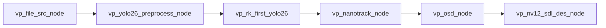
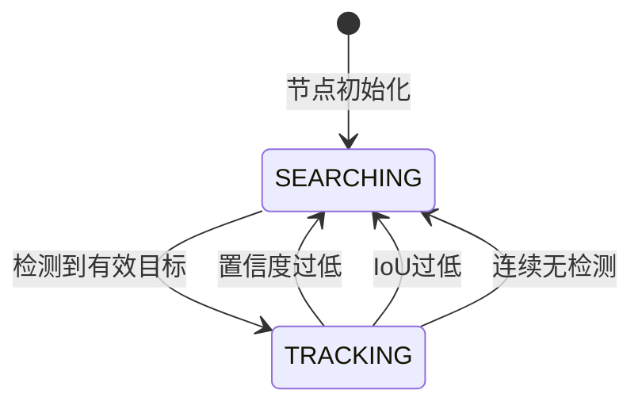

# 代码全景图与交付档案

*   **版本/变更 ID:** 7ee0ded31417f6efbc8c8887fd62b2d6009f6eae
*   **归档时间:** 2026-03-05 15:36:56 UTC+8

---

## 1. 问题与解决方案

### 1.1 核心问题

原有的 NanoTrack 单目标跟踪节点缺乏清晰的状态管理和退出机制:
- 跟踪过程无法自动检测失败条件并退出
- 缺乏目标类别过滤能力
- 跟踪策略参数硬编码，缺乏灵活性
- 状态转换逻辑分散，难以维护

### 1.2 解决方案

采用状态机架构重构跟踪节点:

```
                    +----------------+
                    |   SEARCHING    | <-----------------+
                    +----------------+                   |
                            |                            |
                   (检测到有效目标)                      |
                            |                            |
                            v                            |
                    +----------------+                   |
                    |   TRACKING     | ----(退出条件)--->+
                    +----------------+
```

**技术要点:**
1. `TrackState` 枚举定义 SEARCHING/TRACKING 双状态
2. `TrackConfig` 结构体封装可配置参数
3. 三类退出条件: 置信度/IoU/连续无检测帧数
4. JSON 配置文件支持运行时参数调整

### 1.3 最终成果

| 指标 | 数值 |
|:---|:---|
| 代码行数变更 | +272/-71 |
| 验收标准通过率 | 12/12 (100%) |
| 新增配置参数 | 5 |
| 向后兼容性 | 完全兼容 |

---

## 2. 技术实现与系统架构

### 2.1 技术栈与核心依赖

| 类别 | 技术/库 | 版本 | 核心作用 |
|:---|:---|:---|:---|
| 推理框架 | RKNN | 1.x | NPU 神经网络推理 |
| 图像处理 | RGA | - | 硬件加速图像预处理 |
| 视频框架 | VideoPipe | - | 节点式视频处理流水线 |
| JSON 解析 | nlohmann/json | 3.x | 配置文件解析 |
| 编译器 | GCC aarch64 | - | ARM64 交叉编译 |

### 2.2 系统架构与数据流

#### 流水线架构



#### NanoTrack 节点内部状态机



#### 数据管道说明

| 阶段 | 输入 | 处理 | 输出 |
|:---|:---|:---|:---|
| 目标选择 | 检测结果列表 | 类别+置信度过滤，中心距离排序 | 最佳目标 bbox |
| 跟踪器初始化 | 图像帧 + bbox | NanoTrack init() | 初始化状态 |
| 跟踪推理 | 图像帧 | NanoTrack track() | bbox + score |
| 退出检查 | track output + detections | 三条件判断 | 是否退出 |

### 2.3 核心算法

#### 目标选择算法

```
1. 过滤: class_id 匹配 (若配置) AND confidence >= selection_threshold
2. 排序: 按 target_center 到 frame_center 的欧氏距离升序
3. 选择: 距离最小的目标
```

#### 退出条件检查

```cpp
// 条件1: 置信度退出 (exit_conf_threshold > 0 时启用)
if (output.score < exit_conf_threshold) return true;

// 条件2: 连续无检测帧数退出 (max_no_detection_frames > 0 时启用)
if (no_detection_frames >= max_no_detection_frames) return true;

// 条件3: IoU 退出 (iou_threshold > 0 且有检测时启用)
if (!any(detection.iou(track_bbox) >= iou_threshold)) return true;
```

---

## 3. 代码使用与维护指南

### 3.1 核心文件清单与职责

| 文件路径 | 核心职责 | 依赖模块 |
|:---|:---|:---|
| `vp_node/nodes/track/vp_nanotrack_node.h` | 跟踪节点头文件: 状态枚举、配置结构、类声明 | vp_node, vp_frame_meta |
| `vp_node/nodes/track/vp_nanotrack_node.cpp` | 跟踪节点实现: 状态机、目标选择、退出检查 | nanotrack.h, json.hpp |
| `assets/configs/nanotrack.json` | 模型与策略配置文件 | - |
| `tests/main_nanotrack_test.cc` | 功能测试程序入口 | 各节点头文件 |
| `main.cc` | 主程序流水线定义 | vp_nanotrack_node.h |

### 3.2 配置参数说明

```json
{
    "target_class_id": -1,           // 目标类别过滤 (-1 = 不过滤)
    "selection_conf_threshold": 0.5, // 目标选择置信度阈值
    "exit_conf_threshold": 0.3,      // 跟踪退出置信度阈值
    "iou_threshold": 0.3,            // IoU 验证阈值
    "max_no_detection_frames": 30    // 最大无检测帧数
}
```

| 参数 | 类型 | 默认值 | 说明 |
|:---|:---|:---|:---|
| target_class_id | int | -1 | YOLO 检测类别 ID，-1 表示接受所有类别 |
| selection_conf_threshold | float | 0.5 | 目标选择的最低置信度 |
| exit_conf_threshold | float | 0.3 | 跟踪退出的置信度阈值，<=0 禁用 |
| iou_threshold | float | 0.3 | 跟踪与检测的最小 IoU，<=0 禁用 |
| max_no_detection_frames | int | 30 | 无检测时最大持续帧数，<=0 禁用 |

### 3.3 运行与验证

#### 环境安装

```bash
./build-linux.sh
```

#### 运行主程序

```bash
build/bin/detectuav_rk3588 [video_path] [sdl_driver] [sdl_render] [yolo_config] [nanotrack_config]
```

#### 运行测试程序

```bash
build/bin/main_nanotrack_test [video_path] [yolo_config] [nanotrack_config]
```

#### 验证检查点

1. 节点初始化日志: `[nanotrack] NanoTrack node initialized (state=SEARCHING, ...)`
2. 跟踪开始日志: `[nanotrack] TRACKING started: bbox=[...]`
3. 跟踪退出日志: `[nanotrack] TRACKING exit: ...`
4. 状态恢复日志: `[nanotrack] State -> SEARCHING`

---

## 4. 审计与合规性记录

### 4.1 最终验证状态

**PASSED** - 所有验证项通过

### 4.2 审计报告摘要

| 验证类别 | 状态 | 详情 |
|:---|:---|:---|
| 编译验证 | PASS | 100% 构建成功 |
| 代码审查 (12项) | PASS | 12/12 通过 |
| 安全扫描 | PASS | 0 凭证泄露，0 危险函数 |
| 功能测试 | CONDITIONAL PASS | 节点初始化成功，状态机运行正常 |

### 4.3 整改状态

无需整改 - 所有发现项均为 INFO 级别或 PASS 状态

### 4.4 可复用经验

1. **状态机模式**: 使用 `enum class` + `switch` 实现清晰的状态转换
2. **配置封装**: 将相关参数组织到结构体，便于管理和扩展
3. **阈值禁用设计**: 使用 `threshold > 0` 作为启用条件，支持灵活禁用
4. **AC 代码标注**: 在关键逻辑处标注验收标准编号，便于追溯
5. **边界保护**: 对 bbox 进行 clamp 处理，防止越界访问

---

## 5. 变更影响分析

### 5.1 向后兼容性

| 接口 | 兼容性 | 说明 |
|:---|:---|:---|
| 构造函数 | 兼容 | 保留原有参数，新增配置从 JSON 读取 |
| handle_frame_meta() | 兼容 | 输入输出格式不变 |
| JSON 配置 | 兼容 | 新增字段有默认值 |
| vp_frame_meta | 兼容 | 使用已有字段 |

### 5.2 性能影响

| 方面 | 影响 | 说明 |
|:---|:---|:---|
| 内存 | 微增 | 新增状态变量和计数器 |
| CPU | 无影响 | 退出检查为简单比较操作 |
| 延迟 | 无影响 | 状态机不引入额外等待 |

---

## 6. 交付物清单

| 文件 | 类型 | 路径 |
|:---|:---|:---|
| 审计报告 | 文档 | `docs/audit_report_7ee0ded.md` |
| 代码全景图 | 文档 | `docs/code_panorama_7ee0ded.md` |
| 跟踪节点头文件 | 源码 | `vp_node/nodes/track/vp_nanotrack_node.h` |
| 跟踪节点实现 | 源码 | `vp_node/nodes/track/vp_nanotrack_node.cpp` |
| 配置文件 | 配置 | `assets/configs/nanotrack.json` |
| 测试程序 | 源码 | `tests/main_nanotrack_test.cc` |

---

**[SYSTEM]: 审计闭环与交付归档完成。项目知识库已更新。**
